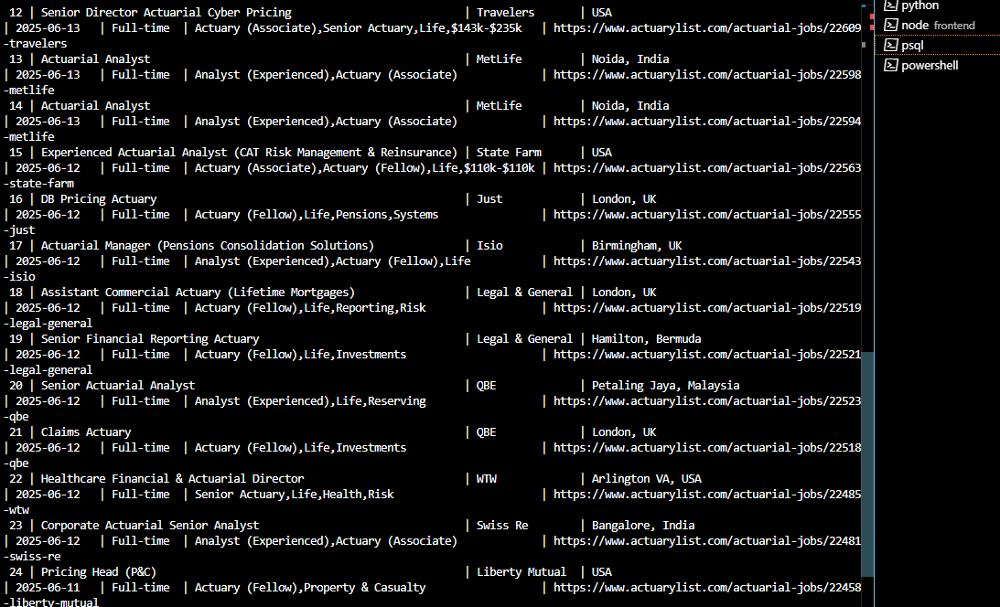

Job Listing Application 

Project Structure

|-->App
|--->__init__.py # Manages all the flask application and database connection
|--->extensions.py # manages the connection to stabalize in the flask app
|--->model.py # jobs table schema defined in it
|--->routes.py # all the crud functionalitites performed in this
|-->scrapper
|--->scrapper.py # scrap data from https://www.actuarylist.com
|-->frontend
|--->public
|--->src
|---->components
|----->FilterControls
|------->FilterControls.jsx
|------->FilterControls.module.css
|----->JobCard
|------->JobCard.jsx
|------->JobCard.module.css
|----->JobForm
|------->JobForm.jsx
|------->JobForm.module.css
|----->Layout
|------->Layout.jsx
|------->Layout.module.css
|---->pages
|----->HomePage
|------->HomePage.jsx
|------->HomePage.module.css
|----->NotFoundPage
|------->NotFound.jsx
|------->NotFoundPage.module.css
|---->services
|------>api.js
|-->run.py
|-->seed.py
|-->requirements.txt


---

##  Project Overview

This is a full-stack **Job Listing Application** that allows you to scrape actuarial jobs from [actuarylist.com](https://www.actuarylist.com), store them in a PostgreSQL database, and manage them through a responsive React frontend.

---

##  Features

###  Backend (Flask + SQLAlchemy)

- REST API Endpoints:
  - `GET /jobs` — List all jobs (with filters and sorting)
  - `GET /jobs/<id>` — Get a specific job
  - `POST /jobs` — Add new job
  - `PUT /jobs/<id>` — Update existing job
  - `DELETE /jobs/<id>` — Delete a job

- Supports filtering and sorting by:
  - Job type
  - Location
  - Tags
  - Posting date

- Error handling with 400/404 responses
- CORS enabled for frontend integration

---

###  Scraper (Selenium + Edge WebDriver)

- Uses XPath to find job cards
- Scrolls page dynamically to load all jobs
- Extracts:
  - Title
  - Company
  - Location
  - Tags
  - Posting date
  - Job type
  - Application link

- Adds new jobs directly to the database
- Avoids duplicates

---

###  Frontend (React + MUI + CSS Modules)

- Fully responsive for **mobile → 4K screens**
- Job cards display:
  - Title, Company, Location
  - Type, Tags, Posting Date

- CRUD Functionalities:
  -  Add Job (shown only on button click)
  -  Edit Job (form pre-filled)
  -  Delete Job (with confirmation)
  -  View details in modal

- Filtering & Sorting:
  - Search by keyword
  - Filter by job type, location, tag
  - Sort by newest or oldest

- Built with **Material UI (MUI)** for modern UI experience

---

##  Setup Instructions

### 1.  Backend Setup (Flask + PostgreSQL)

```bash
cd "Job Listing App"
pip install -r requirements.txt

## Create the PostgreSQL database manually
```CREATE DATABASE joblistings;

### Run the Flask server:
python run.py
# Server will run at http://localhost:5000

## Run the Scrapper
**remain in the root direcotry**
python scrapper/scrapper.py


###  Frontend (React + MUI + CSS Modules)

- 🔹 **Responsive UI** that works across all screen sizes (mobile to 4K)
- 🔹 Built using **React (functional components + hooks)**
- 🔹 UI styled with **Material UI (MUI)** and **CSS Modules**
- 🔹 **Dynamic Job Listing Cards** that show:
  - Title, Company, Location
  - Job Type, Tags, Posting Date

- 🔹 **CRUD Functionalities**:
  -  **Add Job** — Form appears only when 'Add New Job' is clicked
  -  **Edit Job** — Populates form with existing job data
  -  **Delete Job** — Confirmation before deletion
  -  **View Details** — Opens modal with full job info

- 🔹 **Filter & Sort**:
  - Search by **keyword**
  - Filter by **location, job type, and tag**
  - Sort by **posting date** (newest/oldest)

- 🔹 **State Management**:
  - Global job list managed in parent `App.js`
  - Modal/form visibility controlled via state
  - Form resets after submit or cancel

- 🔹 **API Integrated**:
  - Communicates with Flask backend for all job actions
  - Uses `fetch()` to GET, POST, PUT, DELETE jobs

## Frontend

### Initializing instructions

-```cd frontend
-```npm install #installs all the dependencies used in frontend 
-```npm start #starts the development server running on 3000


### Database Table Data
